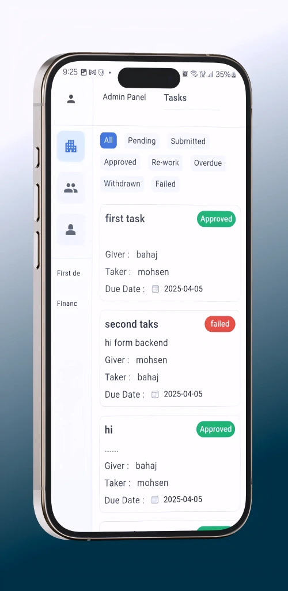
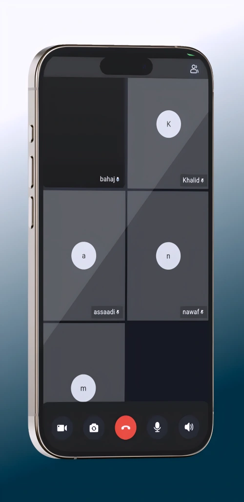

# Neuronhat App

## Table of Contents

- [Project Overview](#1-project-overview)
- [My Role](#my-role)
- [Key Features](#2-key-features)
- [Tech Stack](#3-tech-stack)
- [Architecture](#4-architecture)
- [Core Functional Flows](#5-core-functional-flows)
- [State Management](#6-state-management)
- [API Integration](#7-api-integration)
- [Performance Considerations](#8-performance-considerations)
- [Challenges & Solutions](#9-challenges--solutions)
- [Security Considerations](#10-security-considerations)
- [Scalability & Maintainability](#11-scalability--maintainability)
- [External Links](#12-external-links)
- [Demo](#13-demo)
- [Screenshots](#14-screenshots)
- [Source Code](#source-code)

## 1. Project Overview

Neuronhat is a production Flutter mobile application for internal organizational collaboration. On this branch, the product centers on employee and company-side communication, including personal chats, department chats, group chats, task coordination, file and image sharing, unread-state tracking, push notifications, and calling support. The branch is clearly in a debugging and stabilization phase, with heavy emphasis on making chat behavior reliable under real production conditions.

## My Role

I investigated the disappearing-message issue as a production debugging problem, not a cosmetic defect. I identified where UI state, local persistence, API responses, and socket events were falling out of sync. I fixed the conversation identity flow for newly started chats, redesigned how message state is reconciled after optimistic sends, and tightened the fetch/sync lifecycle so messages remain visible instead of being dropped during reloads. I also improved stability around unread-state updates, socket-driven refreshes, and local cache consistency so the chat system behaves predictably across app sessions and network transitions.

## 2. Key Features

- Personal, group, and department chat flows
- Employee-side and company-side chat experiences
- Optimistic message sending for faster perceived responsiveness
- File and image attachments with local download/cache handling
- Reply, edit, and delete message workflows
- Unread message counters and read-state synchronization
- Push notification support with Firebase Messaging
- Voice/video calling integration through Zego
- Task assignment flows connected to conversation context
- Localization and translated chat UI

## 3. Tech Stack

- Flutter with Dart 3.6
- GetX for routing, dependency injection, and reactive state
- Dio for REST API communication
- Socket.IO client for real-time message events
- Sqflite for local persistence
- Flutter Secure Storage for token and session storage
- Firebase Core and Firebase Messaging for notifications
- Zego UIKit for calling features
- SharedPreferences for lightweight local preferences
- Media/file utilities including image picker, cropper, file picker, cached image loading, and open-file support

## 4. Architecture

The branch uses a layered Flutter structure:

- `views/` for UI screens and widgets
- `viewmodels/` for GetX controllers and presentation logic
- `data/repository/` for API-facing repository classes
- `data/local_data/` for SQLite access and cache helpers
- `data/models/` for chat, conversation, task, and entity models
- `bindings/` for route-scoped dependency injection
- `auth/`, `services/`, and `socket.dart` for cross-cutting runtime services

This is effectively a hybrid offline-first and real-time architecture: the UI reads from reactive controller state, controllers coordinate local SQLite and network fetches, and socket events incrementally patch the live conversation state.

## 5. Core Functional Flows

- User authenticates, session data is loaded from secure storage, and the app routes to the correct dashboard.
- Conversations and cached messages load locally first, then silently sync from the backend.
- Opening a chat resolves its entity context and conversation identity, then hydrates the message timeline.
- Sending a message updates UI state immediately, then reconciles with the API response and local database.
- Socket events push new messages and read events into the same state pipeline used by the fetch layer.
- Task creation can inherit conversation context so operational work remains tied to the chat thread.

## 6. State Management

State is centralized with GetX controllers, especially the chat controllers. The important pattern on this branch is that chat state is no longer treated as a single fragile screen-local list. Instead, the app maintains:

- Reactive message maps keyed by chat ID
- Conversation caches keyed by conversation ID
- Temporary-to-real conversation ID mappings for newly created chats
- Active conversation tracking for read-state behavior
- Separate unread-count state synchronized with both API and local cache

This materially reduces race conditions between screen rebuilds, first-message sends, and background sync.

## 7. API Integration

The branch integrates REST endpoints for:

- Fetching conversations
- Fetching messages by conversation
- Starting a new conversation with a first message
- Sending messages into an existing conversation
- Editing and deleting messages
- Fetching unread message counts

Real-time updates are handled through Socket.IO listeners for new messages, message-read events, user presence, and task events. The key engineering improvement here is that API responses and socket payloads are both normalized into the same local state pipeline instead of competing with each other.

## 8. Performance Considerations

- Local-first loading reduces perceived chat latency
- Silent sync is debounced to avoid excessive refresh churn
- Message sync writes are batched into SQLite transactions
- Conversations and messages are cached in memory per conversation
- Media downloads are deferred and persisted locally
- Cached network images reduce repeated image fetches
- The stabilized state flow avoids unnecessary UI clears and rehydration glitches

## 9. Challenges & Solutions

- Multi-source message state: solved by reconciling UI, SQLite, REST, and socket updates into shared controller state
- New conversation lifecycle: solved by tracking temporary conversation IDs until the server returns the real ID
- Message reliability during refresh: solved by removing logic that cleared or ignored valid message state during fetch
- Attachment consistency: solved by syncing metadata and downloading media into local persistent storage
- Read-state correctness: solved by combining active-conversation tracking with socket and unread-count synchronization

## Debugging Case Study: Message Disappearance Issue

**Problem description**  
Messages were disappearing in the employee chat flow, especially around newly started conversations and synchronization boundaries.

**Observed behavior**  
A message could appear immediately after send, then vanish after fetch/sync, or fail to remain attached to the conversation the user was actively viewing. This was most dangerous on first-message flows, where the app had to transition from a temporary local conversation identity to the real server conversation ID.

**Root cause analysis**  
I identified a state reconciliation problem across three layers:

- The UI was using temporary conversation IDs before the backend returned the real conversation ID.
- The fetch/state layer previously contained logic that could skip or clear valid message state instead of consistently repopulating it.
- Optimistic messages, local cache updates, and server-confirmed messages were not always being reconciled under the same final conversation identity.

That combination created the illusion that a message had disappeared when, in reality, it had either been orphaned under the wrong conversation ID or overwritten during refresh. The key branch evidence is in the conversation-ID remapping and fetch-state cleanup inside [chat_state_controller.dart](/E:/Desktop/flutter/neuronhat/lib/viewmodels/chat/chat_state_controller.dart#L124), [chat_controller.dart](/E:/Desktop/flutter/neuronhat/lib/viewmodels/chat/chat_controller.dart#L48), [fetch_chat_controller.dart](/E:/Desktop/flutter/neuronhat/lib/viewmodels/chat/fetch_chat_controller.dart#L237), and [chat_page.dart](/E:/Desktop/flutter/neuronhat/lib/views/chat/employee/chat_page.dart#L105).

**Technical fix applied**  
I fixed the issue by making conversation identity explicit and durable:

- I introduced entity-scoped temporary conversation mapping so each chat target keeps a stable local identity until the API returns the real one.
- I updated the send pipeline to distinguish between starting a conversation and sending into an existing one.
- I migrated in-memory messages from temporary conversation IDs to the real server conversation ID as soon as the API responded.
- I removed the problematic fetch behavior that was clearing/skipping valid message state.
- I ensured socket-delivered messages and API-fetched messages both flow through the same message update path.

**Preventive improvements**

- Active conversation tracking now supports correct read-state handling
- Local SQLite upserts preserve message continuity across app refreshes
- Silent sync and socket events now reinforce the same message timeline instead of competing with it
- Reply, edit, delete, unread-count, and media-download metadata are persisted in the local store for stronger state recovery
- The chat schema now carries richer lifecycle fields, improving auditability and state reconstruction in future debugging work

## 10. Security Considerations

- Auth tokens and session identifiers are stored with Flutter Secure Storage, not plain local preferences
- Token expiration is checked during startup and invalid sessions are cleared
- Authenticated API calls use bearer-token headers
- Logout tears down socket state to avoid stale real-time sessions
- Sensitive session identifiers such as active employee and organization IDs are stored and accessed centrally through the auth service

## 11. Scalability & Maintainability

This branch improves maintainability by separating responsibilities cleanly across UI, controller, repository, and local persistence layers. The message-disappearance fix is especially important from a scalability perspective because it replaces brittle screen-specific behavior with a reusable identity-reconciliation pattern. That makes the chat system more resilient as additional features such as richer attachments, more socket events, and heavier conversation volumes are introduced.

## 12. External Links

See [External Links](./links.md)

## 13. Demo

See full demo videos: [View Demo](./demo/README.md)

## 📸 Screenshots

  <table style="width: 100%; border-collapse: collapse;">
    <tr>
      <td width="33.33%" align="center">
         
        <b>Dashboard</b>
      </td>
      <td width="33.33%" align="center">
         
        <b>Chat</b>
      </td>
      <td width="33.33%" align="center">
         
        <b>Tasks (Admin View)</b>
      </td>
    </tr>
    <tr>
      <td width="33.33%" align="center">
         
        <b>Video Meeting</b>
      </td>
      <td width="33.33%" align="center">
         
        <b>Profile</b>
      </td>
      <td width="33.33%" align="center">
         
        <b>Employee Details</b>
      </td>
    </tr>
  </table>

For a full view of all application screens including dark mode and calling states, please visit the [Screenshots Gallery](./screenshots/README.md).

## Source Code

This project is part of a real production system.

The source code is not publicly available due to client ownership and confidentiality constraints.

This case study focuses on:
- System architecture
- Key features
- Engineering decisions

