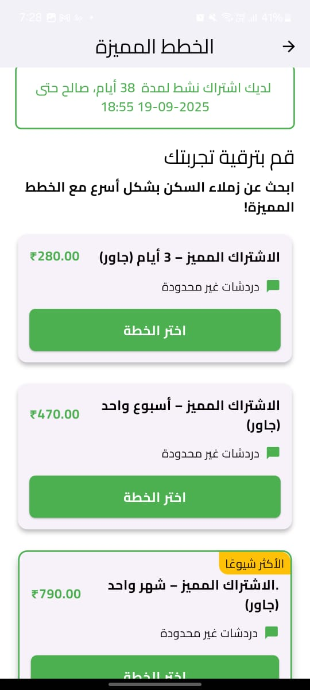
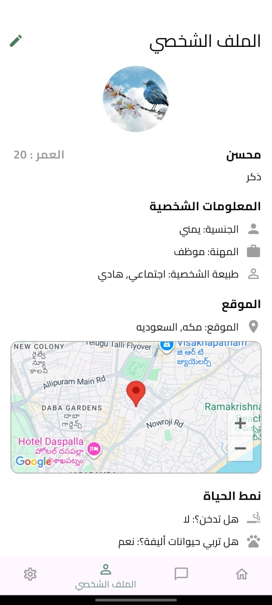

# Screenshots Gallery

This gallery provides a visual overview of the application's features and user interface.

## 📸 Screenshots

  <table style="width: 100%; border-collapse: collapse;">
    <tr>
      <td width="33.33%" align="center">
         
        <b>Login</b>
      </td>
      <td width="33.33%" align="center">
         
        <b>Sign Up</b>
      </td>
      <td width="33.33%" align="center">
         
        <b>Home</b>
      </td>
    </tr>
    <tr>
      <td width="33.33%" align="center">
         
        <b>Roommate Details</b>
      </td>
      <td width="33.33%" align="center">
         
        <b>Chat</b>
      </td>
      <td width="33.33%" align="center">
         
        <b>Complaints</b>
      </td>
    </tr>
    <tr>
      <td width="33.33%" align="center">
         
        <b>Subscriptions</b>
      </td>
      <td width="33.33%" align="center">
         
        <b>In-App Purchase</b>
      </td>
      <td width="33.33%" align="center">
         
        <b>Profile</b>
      </td>
    </tr>
    <tr>
      <td width="33.33%" align="center">
         
        <b>Settings</b>
      </td>
      <td width="33.33%" align="center">
         
        <b>Poster</b>
      </td>
      <td width="33.33%"></td>
    </tr>
  </table>

