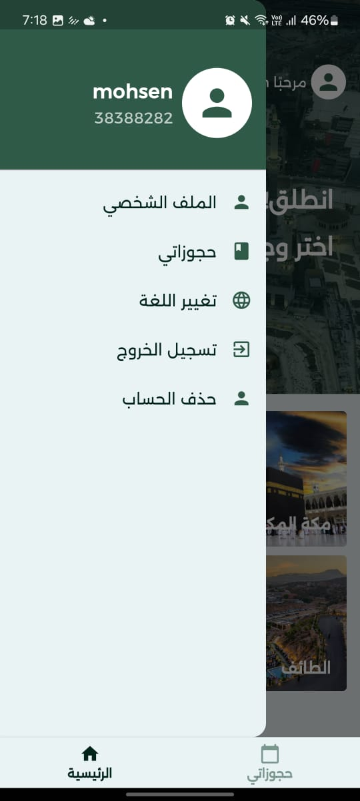

# Taibah Go App

## Table of Contents

- [Project Overview](#1-project-overview)
- [My Role](#2-my-role)
- [Key Features](#3-key-features)
- [Tech Stack](#4-tech-stack)
- [Architecture](#5-architecture)
- [Core Functional Flows](#6-core-functional-flows)
- [State Management](#7-state-management)
- [API Integration](#8-api-integration)
- [Performance Considerations](#9-performance-considerations)
- [Challenges & Solutions](#10-challenges--solutions)
- [Security Considerations](#11-security-considerations)
- [Scalability & Maintainability](#12-scalability--maintainability)
- [External Links](#13-external-links)
- [Demo](#14-demo)
- [Screenshots](#15-screenshots)
- [Source Code](#source-code)

# 1. Project Overview

**Taibah Go** is a Flutter mobile application for browsing tourism destinations, reviewing trip options, and moving through a booking-oriented user journey in Arabic and English. The `main` branch implements the current production UI foundation: splash onboarding, account entry screens, a home discovery experience, trip listing and filtering, booking input, and booking detail review.

The implementation is intentionally lightweight and highly focused on mobile UX consistency. It uses a compact presentation-first architecture, local asset-driven content, and GetX for app structure, localization, navigation, and reactive UI updates.

# 2. My Role

I designed the application architecture around a simple, production-practical separation of concerns: `view`, `view-model`, `utils`, and `constants`. I implemented the mobile user experience end to end, including splash flow, onboarding screens, home discovery, trip listing, booking input, booking review, and bottom-tab navigation.

I integrated GetX as the app’s core framework for navigation, localization, and reactive state handling. I implemented bilingual support for Arabic and English, including persisted locale selection and direction-aware layouts so the app works naturally in RTL and LTR contexts.

I implemented the reusable UI layer, including shared form components, card-based trip and booking presentation, and a centralized color system to keep the visual language consistent across screens. I also implemented the current data flow using local in-memory models and asset-backed content so the production branch remains stable and predictable.

I defined the API integration boundary by keeping this branch free of unfinished network coupling. In this production implementation, trip and booking data are rendered from local/static sources rather than a live backend, which allowed me to stabilize UX, navigation, and localization before introducing remote dependencies.

I implemented state management with GetX observables where reactivity is needed, especially for tab switching and booking date/time selection, while keeping the rest of the UI stateless to reduce complexity. I also applied performance-conscious decisions such as scoped reactivity, builder-based rendering, and lightweight local persistence for user locale preferences.

# 3. Key Features

- Splash screen with timed transition into the onboarding flow
- Bilingual localization for Arabic and English
- Persisted language preference using local storage
- RTL/LTR-aware layout handling across major screens
- Sign-up and login entry screens
- Home dashboard with destination grid
- Trip listing page with category-based filtering
- Booking form with date and time selection
- Booking summary/details screen for reviewing submitted information
- Bottom navigation between home discovery and booking history
- Reusable cards and text field components for consistent UI composition

# 4. Tech Stack

- **Framework:** Flutter
- **Language:** Dart
- **State management / routing / localization:** GetX
- **Local persistence:** `shared_preferences`
- **Typography:** `google_fonts`
- **Platform support in repo:** Android, iOS, Web, Windows, macOS, Linux
- **Splash generation:** `flutter_native_splash`

# 5. Architecture

The app follows a lightweight presentation-oriented structure:

- `lib/view`: screen-level UI and reusable screen widgets
- `lib/view-model`: controller logic, currently used for home tab state
- `lib/utils/local`: local persistence utilities such as locale storage
- `lib/utils/translation`: translation maps and localization definitions
- `lib/constants`: shared visual constants such as the color palette

This is not a heavily layered enterprise architecture; it is a deliberate, small-team-friendly structure optimized for clarity and fast iteration. UI composition stays close to the screens, while shared behavior such as localization and tab control is extracted into dedicated utility and controller layers.

# 6. Core Functional Flows

## Onboarding Flow

The app starts in a splash screen, initializes Flutter bindings, restores the saved locale, and launches the app with the correct language context. After the splash delay, the user is routed into the account creation screen.

## Authentication Entry Flow

The user can move between sign-up and login screens. These screens currently serve as the access layer for the experience and route the user into the main app shell.

## Discovery Flow

From the home tab, the user sees a destination grid backed by local image assets. Selecting a destination opens the trips page.

## Trip Browsing Flow

The trips page presents a list of trip cards and allows filtering by category through choice chips. Selecting a trip routes the user into the booking screen.

## Booking Flow

The booking screen captures date/time, hotel address, contact details, and number of travelers. The bottom summary section presents booking-related pricing information and a confirmation CTA.

## Booking Review Flow

The bookings tab displays prior booking cards. Opening one leads to a read-only booking details view that summarizes key reservation fields.

# 7. State Management

State management is intentionally lean.

- GetX `RxInt` is used for bottom-tab selection in the home shell
- GetX `Rx<DateTime>` is used for reactive booking date/time updates
- Locale changes are handled through GetX localization updates
- Most screens remain stateless and render from local input/state passed into widgets

This approach keeps reactive scope narrow. Only the UI segments that truly need to rebuild are wrapped in `Obx`, which avoids unnecessary widget tree churn.

# 8. API Integration

The `main` branch does **not** include a live backend API client, network service layer, remote repository abstraction, or authenticated server communication. Data shown in trip listings and booking history is currently local and static.

From an engineering perspective, this means the production branch is presently optimized around:

- UX validation
- Localization correctness
- Navigation stability
- Reusable component structure
- Controlled data rendering without backend variability

The integration surface is straightforward to extend later because screens are already separated from utility and controller concerns, but no real HTTP integration is implemented in this branch.

# 9. Performance Considerations

- Builder-based rendering is used for destination grids
- Reactive rebuilds are limited to small UI areas with `Obx`
- Asset-based local content eliminates network latency in the current implementation
- Reusable components reduce duplicated widget complexity
- Stateless widgets are used extensively to keep rebuild behavior simple
- Locale preference is restored once at startup, preventing repeated configuration work during runtime

Given the current scope, the app’s performance profile is lightweight and predictable.

# 10. Challenges & Solutions

## Bilingual Mobile UX

A major challenge was supporting both Arabic and English cleanly. I solved this by combining GetX translations, persisted locale preferences, and direction-aware layout handling so the app can switch between RTL and LTR usage patterns with minimal duplication.

## Keeping the UI Consistent Across Flows

The app spans onboarding, discovery, booking, and booking review. I solved visual inconsistency risk by centralizing colors and reusing shared widgets such as the custom text field and card-based layouts.

## Avoiding Overengineering

For the current product stage, adding a full backend/data layer would have increased delivery risk. I solved this by stabilizing the user-facing flows first with local/static data, which keeps the branch production-safe while preserving a clean path for future API integration.

# 11. Security Considerations

- No secrets or API keys are embedded in the analyzed branch
- No live authentication or token storage flow is implemented in this branch
- `shared_preferences` is used only for locale persistence, which is low risk
- The absence of backend connectivity reduces exposure to transport/auth vulnerabilities in the current implementation
- If backend auth is introduced later, sensitive credentials and tokens should move to secure storage rather than standard preferences

# 12. Scalability & Maintainability

The project is maintainable because the codebase is small, legible, and organized by responsibility. The current structure supports incremental growth without requiring an immediate rewrite.

Scalability-ready aspects include:

- clear separation between screens, controller logic, localization, and constants
- reusable UI primitives for forms and cards
- a centralized localization system
- a single navigation/state framework across the app

Areas that would naturally evolve next for scale:

- repository/service layer for remote APIs
- form validation and submission orchestration
- typed domain models for bookings and destinations
- secure authentication/session handling
- automated widget and integration testing

## 13. External Links

See [External Links](./links.md)

## 14. Demo

See full demo videos: [View Demo](./demo/README.md)

## 📸 Screenshots

  <table style="width: 100%; border-collapse: collapse;">
    <tr>
      <td width="33.33%" align="center">
         
        <b>Home</b>
      </td>
      <td width="33.33%" align="center">
         
        <b>Available Trips</b>
      </td>
      <td width="33.33%" align="center">
         
        <b>Places</b>
      </td>
    </tr>
    <tr>
      <td width="33.33%" align="center">
         
        <b>Login</b>
      </td>
      <td width="33.33%" align="center">
         
        <b>Trips History</b>
      </td>
      <td width="33.33%" align="center">
         
        <b>Settings</b>
      </td>
    </tr>
  </table>

For a full view of all application screens including dark mode and calling states, please visit the [Screenshots Gallery](./screenshots/README.md).

## Source Code

This project is part of a real production system.

The source code is not publicly available due to client ownership and confidentiality constraints.

This case study focuses on:
- System architecture
- Key features
- Engineering decisions

