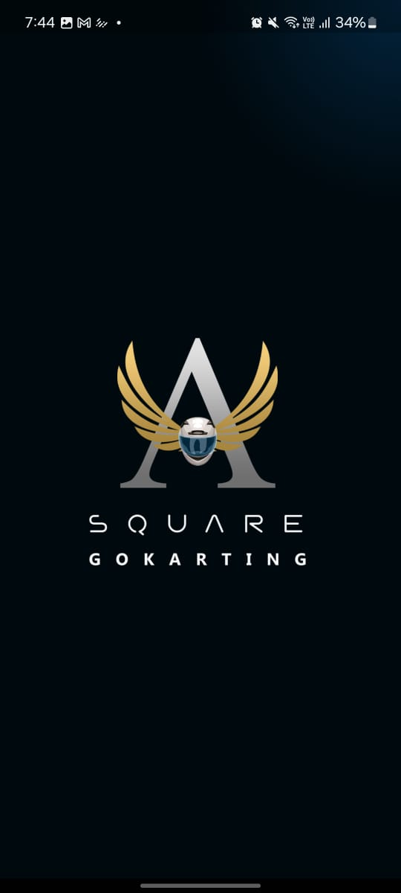
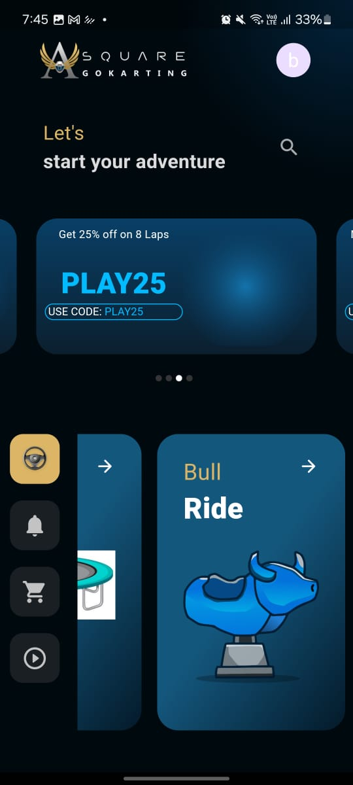
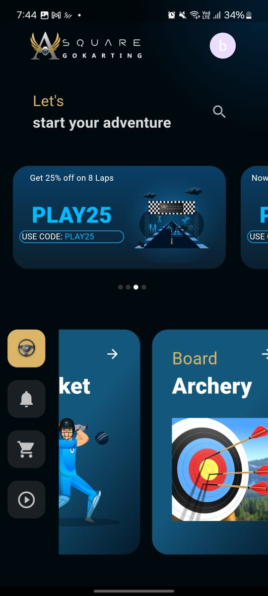
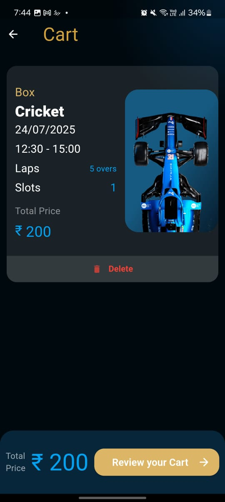
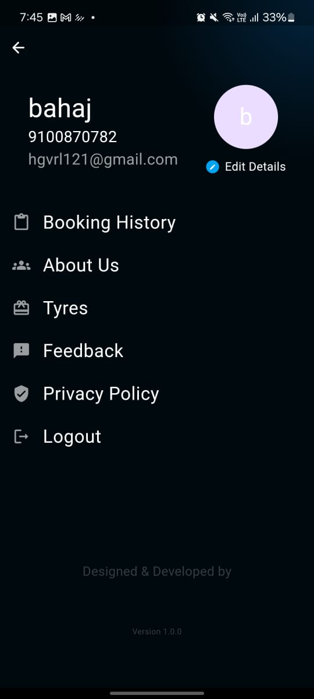
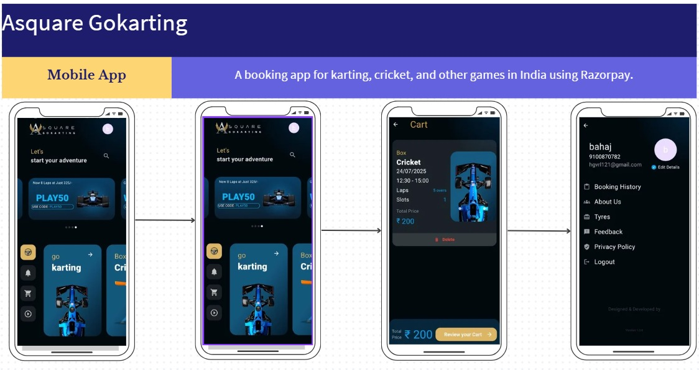

# Screenshots Gallery

This gallery provides a visual overview of the application's features and user interface.

## 📸 Screenshots

  <table style="width: 100%; border-collapse: collapse;">
    <tr>
      <td width="33.33%" align="center">
         
        <b>Splash Screen</b>
      </td>
      <td width="33.33%" align="center">
         
        <b>Home Screen</b>
      </td>
      <td width="33.33%" align="center">
         
        <b>Activity Discovery</b>
      </td>
    </tr>
    <tr>
      <td width="33.33%" align="center">
         
        <b>Dashboard</b>
      </td>
      <td width="33.33%" align="center">
         
        <b>Cart</b>
      </td>
      <td width="33.33%" align="center">
         
        <b>Order Review</b>
      </td>
    </tr>
    <tr>
      <td width="33.33%" align="center">
         
        <b>Notifications</b>
      </td>
      <td width="33.33%" align="center">
         
        <b>Settings</b>
      </td>
      <td width="33.33%" align="center">
         
        <b>App Poster</b>
      </td>
    </tr>
  </table>

