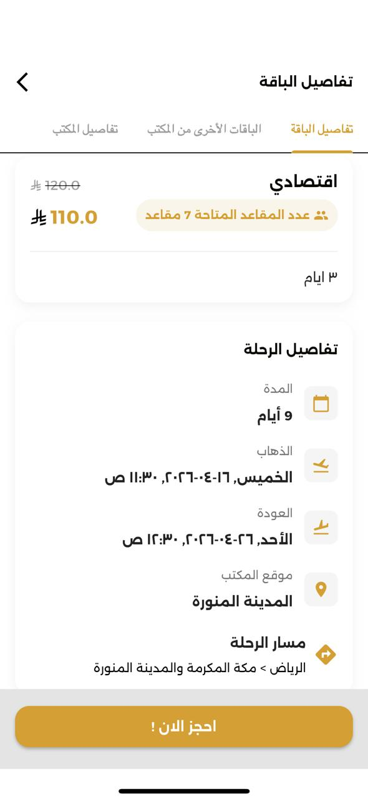

# Mataf App

## Table of Contents

- [Project Overview](#1-project-overview)
- [My Role](#my-role)
- [Key Features](#2-key-features)
- [Tech Stack](#3-tech-stack)
- [Architecture](#4-architecture)
- [Core Functional Flows](#5-core-functional-flows)
- [State Management](#6-state-management)
- [API Integration](#7-api-integration)
- [Performance Considerations](#8-performance-considerations)
- [Challenges & Solutions](#9-challenges--solutions)
- [Security Considerations](#10-security-considerations)
- [Scalability & Maintainability](#11-scalability--maintainability)
- [External Links](#12-external-links)
- [Demo](#13-demo)
- [Screenshots](#14-screenshots)
- [Disclaimer](#15-disclaimer)

## 1. Project Overview

Mataf is a production Flutter mobile application derived from the same core platform as UmrahGo, but positioned as a distinct product with separate branding, backend domain, package identifiers, and a materially redesigned consumer experience. It focuses on a more curated package-discovery journey while preserving the underlying booking, authentication, profile, chat, and provider-support foundations.

I owned the product-level mobile engineering required to turn the shared platform base into a separate deployable app. That included branch-specific backend separation, app identity separation, full UI/UX redesign of the consumer experience, updated navigation and discovery architecture, continued booking/payment support, and independent production delivery as a standalone app on iOS and Android.

## My Role

I led the engineering work that transformed the shared platform into Mataf as a separate product. I implemented the branch-based product evolution from UmrahGo into a distinct application with its own backend domain, package identifiers, branding, navigation behavior, release configuration, and store-facing deployment identity.

I designed and implemented the full UI/UX redesign on top of the existing platform foundation. That included restructuring the home experience around curated offers, most requested packages, featured content, redesigned package cards, shimmer-based loading states, updated bottom navigation behavior, and a more product-driven discovery flow.

I also preserved and re-integrated the core business system inside the redesigned product: authentication, OTP verification, booking creation, coupon handling, payment continuation, profile flows, notifications, chat, office-related package enrichment, and app update handling. My ownership covered both the product redesign and the engineering continuity required to keep Mataf production-ready as its own app.

## 2. Key Features

- Email/password, OTP, password reset, and Google sign-in authentication
- Curated home experience with offers, most requested packages, and featured packages
- Package detail flow enriched with related office packages and office offers
- Package booking with passenger forms, accommodation selection, coupon support, and hosted payment continuation
- Notifications, chat, profile management, documents, and language handling
- Provider/office package and hotel support still present in the branch
- Change-password support added in the auth layer

I implemented these features within a redesigned product surface, ensuring Mataf felt like a separate app rather than a themed fork. The engineering work combined UI/UX redesign with preserved business continuity across booking, auth, and support flows.

## 3. Tech Stack

- Flutter with Dart
- GetX for state, routing, bindings, and dependency management
- Dio and `http` for networking
- Firebase Core, Firebase Messaging, Firebase Auth, Google Sign-In
- Google Maps Flutter for location-linked package/hotel/profile experiences
- WebView for payment continuation
- Shared Preferences for persisted auth/account state
- Cached network image and shimmer-based loading states
- New Version Plus for store-update prompting

I kept the shared core technology strategy where it served reuse, and I extended the product-specific UI layer where Mataf needed its own experience. This allowed me to deliver a separate production app without duplicating the entire platform stack.

## 4. Architecture

Mataf keeps the same broad layered foundation, but the branch shows stronger product shaping in the presentation layer:

- Shared service/model/core architecture remains intact
- Consumer home flow is redesigned into dedicated sections and specialized controllers
- Offer handling is elevated into first-class discovery logic
- Package detail flow is expanded to include same-office package context and office offers
- Navigation and bottom-bar presentation are updated for a more premium branded UX

I designed this branch as a product-specific evolution of the shared platform, not just a visual variation. This is important technically: Mataf is not only a theme fork. It is a branch-level product variation with its own API host, app identifiers, navigation behavior, and content model emphasis. I implemented that separation directly through branch-specific API/domain configuration, package IDs, version-check targets, route behavior, and redesigned presentation modules.

## 5. Core Functional Flows

- Authentication flow: login/signup -> OTP handling -> profile/bootstrap -> notification token registration -> main app entry
- Discovery flow: browse offer carousel -> browse most requested/featured sections -> open section-specific list -> inspect package details
- Package detail flow: load package by ID -> fetch same-office related packages -> fetch office offers -> continue to booking
- Booking flow: collect pilgrim/passenger details -> validate coupon -> choose cash or electronic payment -> create booking -> confirmation/payment continuation
- Payment flow: create hosted payment session against Mataf backend -> open checkout WebView -> poll payment result -> finalize booking state
- Support flow: notifications, chat home, direct chat, profile/document management

I implemented these flows so the redesigned discovery and branded UI remained fully connected to the underlying booking system. My role here included preserving business-critical flows while restructuring how users discover, evaluate, and move through packages inside Mataf.

## 6. State Management

GetX remains the state backbone, but this branch uses it in a more product-specific way:

- Dedicated controllers for home sections and detail enrichment
- Reactive loading/error states for offers, featured content, most-requested content, and offline handling
- Shared preferences retain auth and account metadata
- Main navigation state coordinates section-aware discovery rather than only simple tab switching

I implemented this state structure to support the redesigned consumer journey. The goal was not only to manage data loading, but also to express product intent: curated entry points, content-specific loading states, offline retry behavior, and tighter coordination between navigation and discovery sections.

## 7. API Integration

Mataf is connected to its own production backend domain and app identity, separate from UmrahGo:

- Distinct API base URL for auth, packages, offers, office details, bookings, and payments
- Offers endpoint is directly integrated into the home experience
- Public office packages and office offers are fetched to enrich package detail pages
- Booking and payment flows are preserved but repointed to Mataf infrastructure
- Change-password support exists as a dedicated authenticated API action

I implemented this integration through explicit environment and product separation. I repointed auth, package, offer, office-detail, booking, payment, and update-related mobile logic to Mataf infrastructure while keeping the app behavior coherent. From an engineering perspective, the key decision was clean environment separation while reusing a stable platform core.

## 8. Performance Considerations

- Cached images are used aggressively in the redesigned discovery experience
- Skeleton/shimmer loading improves perceived performance during package/offer fetches
- The home screen is split into focused sections instead of one overloaded listing
- Refresh and offline retry patterns are built into the consumer home experience
- PageView-based offer presentation reduces initial content clutter while keeping curated discovery prominent

I made these changes as product and engineering decisions together. I optimized Mataf around perceived speed, clearer content hierarchy, and reduced cognitive load, especially on the landing experience where curated offers and premium package presentation drive first impressions.

## 9. Challenges & Solutions

- Shared-core, separate-product challenge: solved by branch isolation, separate backend domain, and separate app IDs
- Redesign without rewriting the platform: solved by reusing services/models while rebuilding the presentation layer around offers and curated sections
- Discovery clarity: solved by replacing a flatter browsing experience with offers, most-requested, and featured entry points
- Detail-page depth: solved by joining package details with related office packages and office offers
- Brand differentiation: solved through UI/navigation restructuring rather than only asset swaps

I solved the hardest Mataf challenge by treating it as product engineering, not simple re-skinning. I preserved platform reuse where it created leverage, and I rebuilt the user-facing experience where the product needed separation. That made Mataf a true branch-based product evolution and an independently deployable app, not just a derivative UI layer.

## 10. Security Considerations

- Authenticated requests rely on bearer-token handling and persisted session state
- OTP and password recovery remain part of the access-control model
- FCM registration is tied to authenticated flow
- Change-password support strengthens account-management coverage
- Public recruiter documentation should avoid secrets, keystore details, tokens, and any environment-sensitive material
- As with any production mobile client, debug-only network relaxations should not be described as production security posture

I integrated these security-relevant responsibilities into the app’s main flows and maintained them while separating Mataf from UmrahGo at the product level. That ensured the redesign did not compromise identity, session, notification, or recovery behavior.

## 11. Scalability & Maintainability

- Shared-core architecture keeps platform cost under control while allowing brand/product divergence
- Branch-specific presentation logic means Mataf can continue evolving independently without destabilizing UmrahGo
- Offer modeling and related-package enrichment make content-driven growth easier
- Service isolation still supports future backend expansion without large controller rewrites
- This branch demonstrates a scalable product-family strategy: one strong core, multiple deployable branded apps

I designed Mataf’s maintainability around controlled product divergence. The shared foundation reduces duplication, while branch-specific presentation, environment configuration, and feature shaping let Mataf continue evolving independently. This is the core engineering strategy that made separate deployment practical.

## 12. External Links

See [External Links](./links.md)

## 13. Demo

See full demo videos: [View Demo](./demo/README.md)

## 📸 Screenshots

  <table style="width: 100%; border-collapse: collapse;">
    <tr>
      <td width="33.33%" align="center">
         
        <b>Home</b>
      </td>
      <td width="33.33%" align="center">
         
        <b>Package Details</b>
      </td>
      <td width="33.33%" align="center">
         
        <b>Office Dashboard</b>
      </td>
    </tr>
    <tr>
      <td width="33.33%" align="center">
         
        <b>Chat</b>
      </td>
      <td width="33.33%" align="center">
         
        <b>Bookings</b>
      </td>
      <td width="33.33%" align="center">
         
        <b>Profile</b>
      </td>
    </tr>
  </table>

For a full view of all application screens including dark mode and calling states, please visit the [Screenshots Gallery](./screenshots/README.md).

## 15. Disclaimer

> This project’s source code is private due to client confidentiality. Detailed code walkthrough can be provided upon request.
