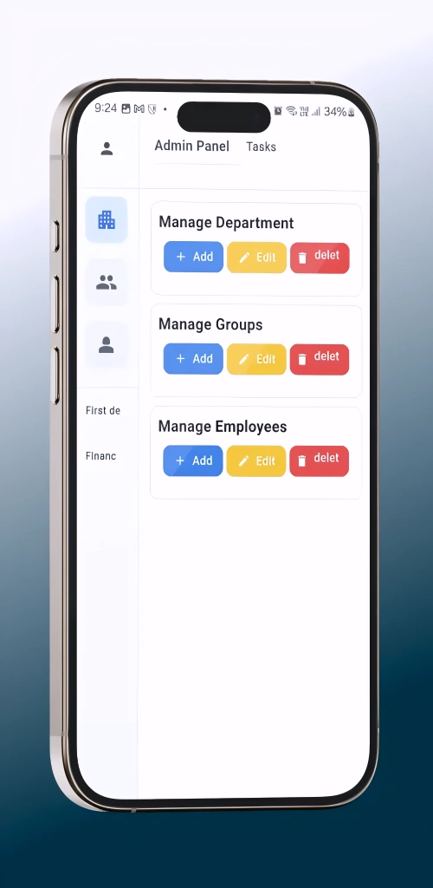
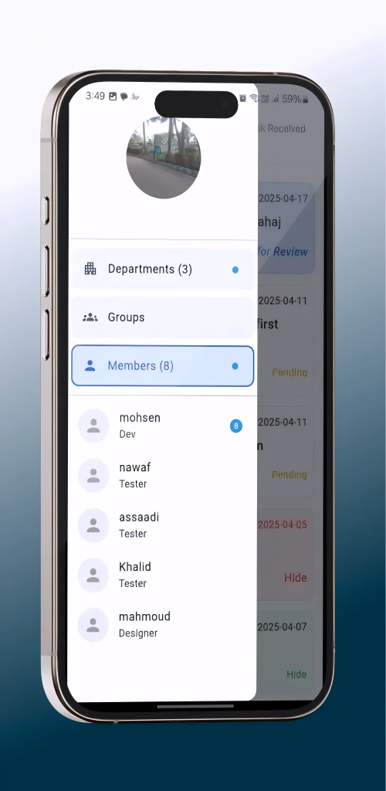
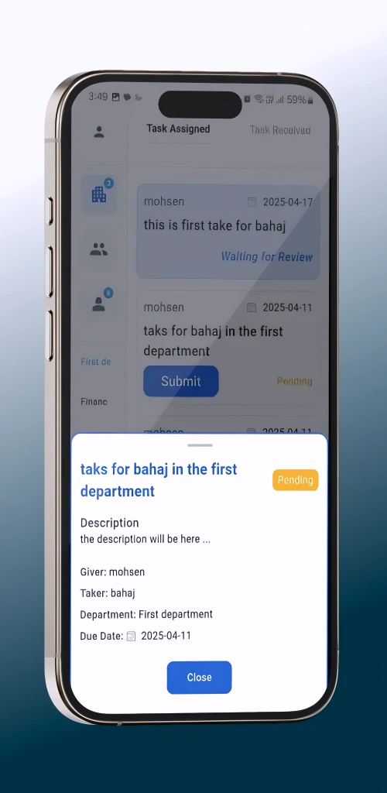
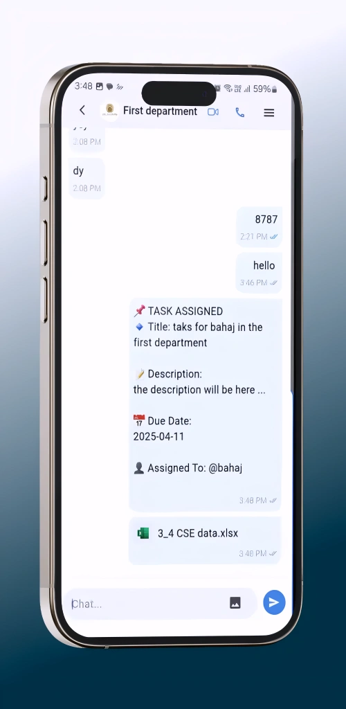
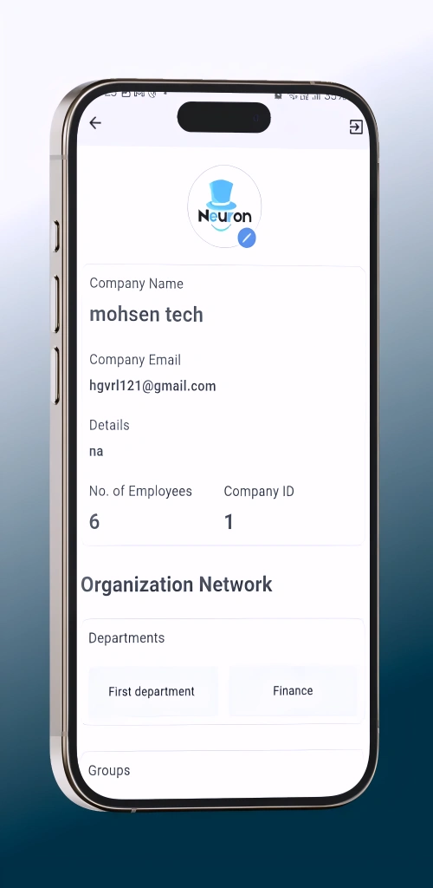
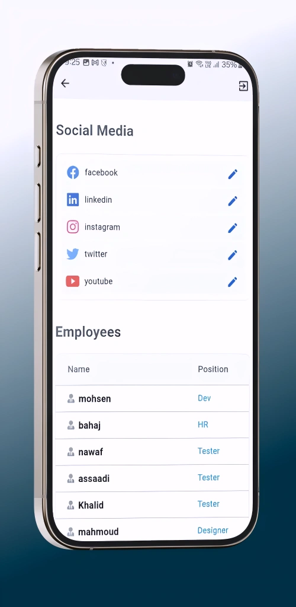
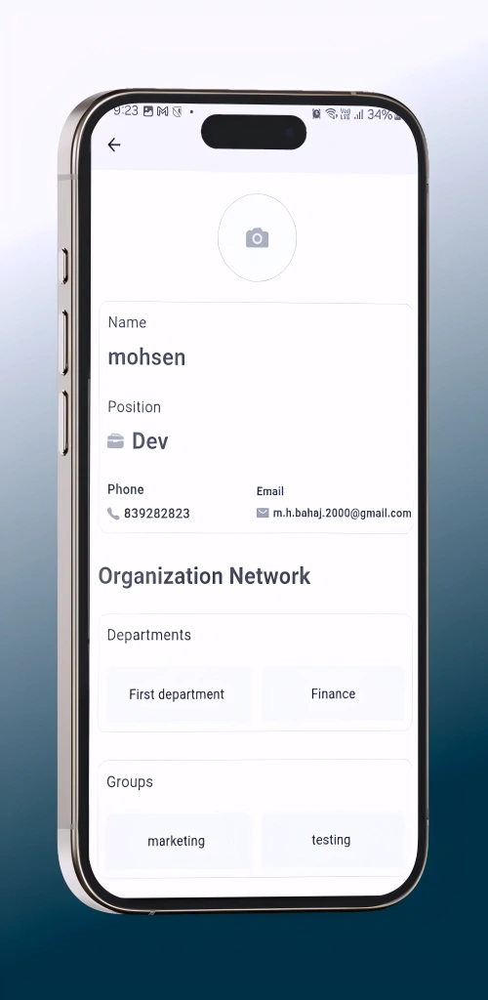

# Screenshots Gallery

This gallery provides a visual overview of the application's features and user interface.

## Dashboard & Navigation

### Dashboard Page

### Navigation Drawer

## Task Management

### Tasks (Admin View)

### Task Details

## Chat & Collaboration

### Chat Conversation

### Chat with Tasks Integration

### Video Meeting

## Company & Employees

### Company Details

### Employee Details

## Profile

### Profile Page

## Store Presence

### App Store Screenshot

