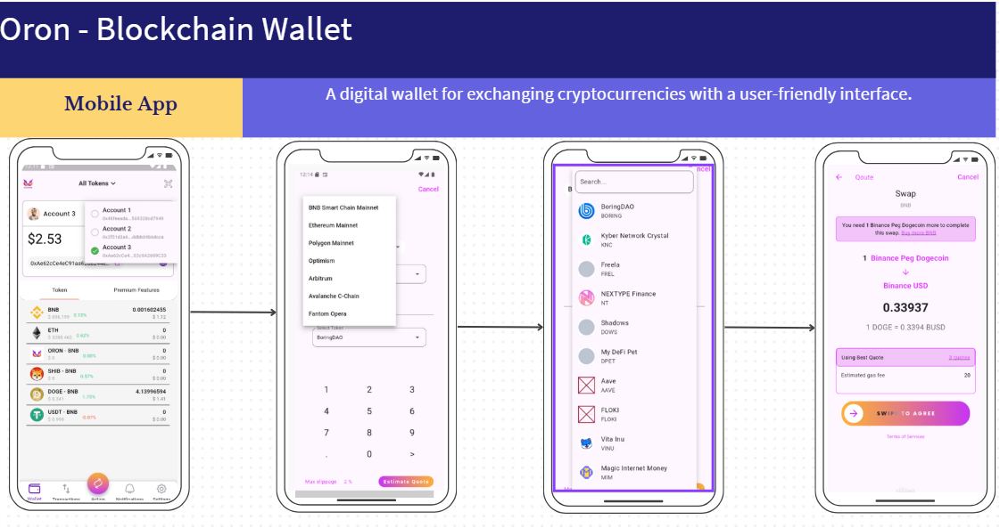

# Screenshots Gallery

This gallery provides a comprehensive visual walkthrough of the Oron Wallet application, highlighting the core dashboard, asset management, and transactional flows.

## Dashboard & Account Overview

### Wallet Dashboard – Account Overview & Token Balances

### Wallet Dashboard – Token Portfolio (Detailed View)

## Asset Management & Swap Flow

### Swap Screen – Token Selection & Amount Input

### Swap Quote Screen – Price, Fees & Confirmation

### Token Selection Modal – Search & Asset List

### Network Selection Modal – Blockchain Switching

## Security & Settings

### Settings Screen – Security & Preferences

## Promotional Overview

### Project Poster

