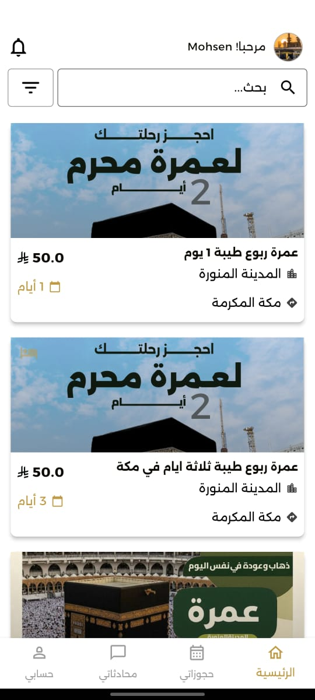
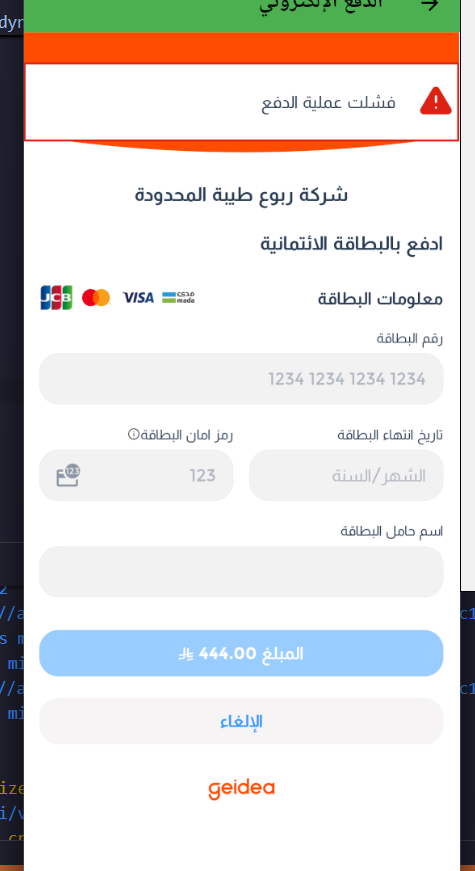

## UmrahGo Technical Case Study

Branch analyzed: `ios`

# Umrah Go App

## Table of Contents

- [Project Overview](#1-project-overview)
- [My Role](#my-role)
- [Key Features](#2-key-features)
- [Tech Stack](#3-tech-stack)
- [Architecture](#4-architecture)
- [Core Functional Flows](#5-core-functional-flows)
- [State Management](#6-state-management)
- [API Integration](#7-api-integration)
- [Performance Considerations](#8-performance-considerations)
- [Challenges & Solutions](#9-challenges--solutions)
- [Security Considerations](#10-security-considerations)
- [Scalability & Maintainability](#11-scalability--maintainability)
- [External Links](#12-external-links)
- [Demo](#13-demo)
- [Screenshots](#14-screenshots)
- [Disclaimer](#15-disclaimer)

## 1. Project Overview

UmrahGo is a production Flutter mobile application for the Umrah travel lifecycle. It supports consumer booking flows and provider/operator workflows in the same mobile codebase, covering package discovery, hotel and transport-related services, booking management, chat, profile/document handling, and payment orchestration.

I owned the end-to-end mobile engineering of this product across architecture, API integration, authentication and onboarding, booking flow implementation, provider-facing management screens, platform configuration, release readiness, and production delivery for iOS and Android.

## My Role

I designed and implemented the mobile application architecture that supports multiple account types inside a single production Flutter codebase. I built and integrated the authentication system, onboarding and OTP verification flows, booking lifecycle, chat and notification infrastructure, profile and document management, and payment continuation flow.

I owned the API integration layer across the main business domains, including authentication, packages, bookings, profile, notifications, chat, files, payments, offices, buses, hotels, and provider operations. I also implemented role-aware navigation so the same app could serve regular users, Umrah offices, and transport operators without fragmenting the platform into separate client codebases.

I drove production-oriented engineering decisions around dependency organization, service isolation, state management, release configuration, and cross-platform capability integration. That ownership included Firebase setup, Google sign-in, maps/location support, local persistence, WebView-based payment continuation, app update prompting, and the overall mobile product structure needed to sustain a live deployment.

## 2. Key Features

- User authentication with email/password, OTP verification, password reset, Google sign-in, and guest access
- Public discovery of Umrah packages, hotels, offices, and transport offerings
- Package detail and package booking flow with passenger entry, accommodation options, coupon validation, and cash/electronic payment paths
- Booking overview, booking detail, cancellation, invoice/PDF-related flows, and post-trip rating
- In-app chat and unread conversation tracking
- Notifications via Firebase Cloud Messaging and local notification handling
- Profile management, document handling, language/currency preferences, and account upgrade flow
- Provider/operator modules for package, bus, and hotel creation and management, plus dashboards/statistics

I implemented these features as connected production flows rather than isolated screens, ensuring that auth state, account type, API data, and user actions remained consistent from onboarding through booking completion and provider operations.

## 3. Tech Stack

- Flutter with Dart
- GetX for routing, dependency injection, controller lifecycle, and state management
- Dio and `http` for API communication
- Firebase Core, Firebase Auth, Firebase Messaging, Google Sign-In
- Google Maps Flutter, Geolocator, Permission Handler
- WebView for hosted payment continuation
- Shared Preferences for local session/config persistence
- PDF, file picker, open file, share utilities
- Cached network image, fl_chart, table_calendar, localization support

I selected and integrated this stack to balance rapid iteration, production stability, role-based app complexity, and cross-platform delivery requirements. GetX provided a lightweight but scalable structure for routing, state, and dependency injection, while Dio and typed models supported maintainable API integration across many service domains.

## 4. Architecture

The app follows a practical layered structure:

- `presentation/`: screens and GetX controllers for user and provider flows
- `data/services/`: API-facing services for auth, packages, bookings, profile, chat, notifications, payments, offices, buses, hotels, documents, and dashboard data
- `model/`: typed request/response/domain models
- `core/`: shared infrastructure such as routes, middleware, status enums, API helpers, validation, responsive utilities, and app constants
- `bindings/` and service initialization: dependency registration at app startup

I designed this architecture to keep the UI layer focused on orchestration and rendering, while business rules and backend communication stayed isolated inside service and model layers. This branch is effectively a multi-role mobile platform. One codebase serves normal users, Umrah offices, and bus operators, with account-type-driven navigation and screen availability. I implemented that multi-role structure directly in the routing, service registration, and controller boundaries.

## 5. Core Functional Flows

- Authentication flow: login/signup -> OTP verification when needed -> profile bootstrap -> FCM registration -> role-aware navigation
- Discovery flow: browse/filter packages -> inspect package details -> review office/hotel/trip data
- Booking flow: choose package -> add pilgrims/passenger data -> optionally apply coupon -> choose payment mode -> create booking -> show confirmation or payment continuation
- Payment flow: initiate hosted payment session -> open WebView checkout -> poll backend payment result -> confirm paid booking
- Post-booking flow: booking overview -> detail screen -> cancellation/invoice/rating
- Provider flow: create/update packages, hotels, buses, and review operational statistics/bookings
- Communication flow: fetch conversations, unread counts, messages, and message actions such as archive/read

I implemented these flows end to end and connected them through shared auth state, controller lifecycle management, and backend services. My ownership here was not limited to UI transitions; I built the orchestration between form validation, API calls, payment state handling, profile hydration, and role-based navigation.

## 6. State Management

State is managed primarily with GetX:

- Controllers own screen state and async orchestration
- `Rx` observables handle loading, error, form, and list updates
- Services are registered once and injected where needed
- Shared preferences act as persistent app/session state for token, role, account type, splash flag, and identity metadata

I implemented this state model to support a large feature surface without introducing heavy architectural overhead. This kept the app lightweight while still supporting many independent modules. I also used persistent session state to ensure the app could restore identity, account type, and navigation decisions reliably across launches.

## 7. API Integration

UmrahGo targets its own production backend domain and exposes a broad API surface:

- Auth endpoints for registration, login, OTP, password reset, and social auth
- Public endpoints for packages, hotels, buses, offices, operators, and app info
- Authenticated endpoints for bookings, payments, profile, notifications, files, office management, and operator management
- Multipart upload flows for packages/hotels/documents/images
- Role-specific API usage depending on whether the account is a pilgrim, office, or operator

I implemented this integration through service-level isolation: each domain has its own service class, which keeps the presentation layer thin and makes the app easier to evolve. I also handled token-aware requests, multipart uploads, response parsing, validation feedback, OTP flows, social login handoff, FCM token registration, and payment-session interactions as part of the production mobile layer.

## 8. Performance Considerations

- Pagination is used in package and booking retrieval paths
- Cached images reduce repeated network cost in listing/detail views
- GetX dependency reuse limits unnecessary object recreation
- Refresh patterns are implemented for high-traffic screens such as home and bookings
- Hosted payment via WebView offloads checkout complexity from the native layer
- Version-check logic helps keep production users on supported builds

I made these decisions to keep the app responsive while supporting real-world travel content, multi-step booking flows, and repeated network interaction. I optimized the mobile side around perceived performance, controlled refresh behavior, and reduced unnecessary reloads across commonly visited screens.

## 9. Challenges & Solutions

- Multi-role complexity: solved through account-type-based navigation and service segmentation
- Large feature surface in one app: solved with modular folder/service organization
- Real-world booking data complexity: handled with typed models for packages, passengers, bookings, payments, offices, and reviews
- Payment uncertainty: handled with payment-session creation plus backend polling for final status
- Operational communications: handled with chat services and unread-count tracking
- Cross-platform delivery: solved through Flutter while preserving native integrations for notifications, maps, auth, and app updates

I solved these challenges by structuring the app as a unified platform with clearly separated responsibilities. I made the core decisions around how to keep one app usable for multiple roles, how to make booking state reliable, and how to integrate operational features such as chat, notifications, and provider management without destabilizing the consumer experience.

## 10. Security Considerations

- Authenticated API calls use bearer-token authorization
- OTP verification and password reset are part of the onboarding/recovery path
- FCM token registration is done only after authenticated state is available
- File/document uploads are isolated to dedicated services rather than scattered across UI code
- Public documentation should avoid exposing secrets, tokens, keystore material, or environment-specific credentials
- For a public recruiter-facing write-up, I note that any debug-only permissive networking behavior must be excluded from hardened production builds

I integrated the security-sensitive client responsibilities directly into the product flows, especially around auth, token persistence, password recovery, and notification registration. I also separated sensitive upload and account actions into dedicated services so those interactions remained explicit and easier to control.

## 11. Scalability & Maintainability

- Clear service/domain boundaries make it easier to extend booking, profile, or provider modules independently
- GetX bindings and service initialization provide consistent dependency wiring
- Strong model coverage reduces JSON parsing drift as APIs evolve
- Shared UI components keep repeated form, auth, and list patterns maintainable
- The branch is already structured to support continued feature growth across consumer and provider roles without splitting into multiple mobile clients

I designed the codebase to scale functionally without forcing a rewrite each time a new business area was added. The maintainability strategy centered on service segmentation, typed models, reusable UI elements, and a stable initialization pattern so new domains could be added with controlled impact.

## 12. External Links

See [External Links](./links.md)

## 13. Demo

See full demo videos: [View Demo](./demo/README.md)

## 14. Screenshots

### Home

### Package Details

### Booking Form

### Payment

### Chat

### Bookings

For a full view of all application screens including dark mode and calling states, please visit the [Screenshots Gallery](./screenshots/README.md).

## 15. Disclaimer

> This project’s source code is private due to client confidentiality. Detailed code walkthrough can be provided upon request.
