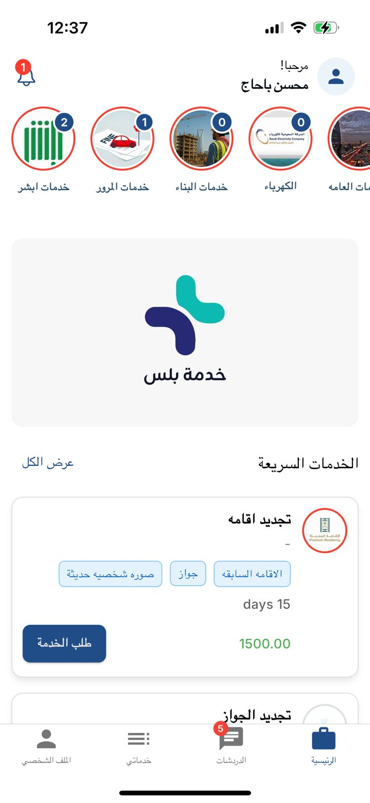

# Service Plus App

## Table of Contents

- [Project Overview](#1-project-overview)
- [My Role](#my-role)
- [Key Features](#2-key-features)
- [Tech Stack](#3-tech-stack)
- [Architecture](#4-architecture)
- [Core Functional Flows](#5-core-functional-flows)
- [State Management](#6-state-management-approach)
- [API Integration](#7-api-integration)
- [Performance Considerations](#8-performance-considerations)
- [Challenges & Solutions](#9-challenges--solutions)
- [Security Considerations](#10-security-considerations)
- [Scalability & Maintainability](#11-scalability--maintainability)
- [External Links](#12-external-links)
- [Demo](#13-demo)
- [Screenshots](#14-screenshots)
- [Disclaimer](#15-disclaimer)

## 1. Project Overview

This project is a cross-platform Flutter mobile application that I engineered as a unified client experience for digital civil-service interactions. It enables users to discover public services, submit service requests, track request progress, communicate with assigned staff, and manage their profiles within a single mobile platform.

The system addresses fragmentation in traditional service delivery by consolidating multiple disconnected processes—such as service discovery, request handling, communication, and follow-up—into a single, consistent mobile workflow. This reduces reliance on manual support channels and improves both user experience and operational efficiency.

From an engineering perspective, I designed the application as a production-oriented system rather than a simple mobile interface. It combines structured transactional workflows with real-time capabilities, allowing the client to handle both predictable operations (such as service requests and status tracking) and dynamic interactions (such as messaging and live updates).

The architecture reflects this dual nature by integrating REST-based communication for core business operations with asynchronous mechanisms such as push notifications and WebSocket-driven updates. This enables the application to remain responsive, state-aware, and synchronized with backend events in near real time, while maintaining reliability across different usage scenarios.

## My Role

I was responsible for the mobile application engineering layer and for shaping how the product behaves from both a user-experience and systems-integration perspective.

My responsibilities included:

- **Designing the app’s modular structure**  
  I organized the codebase around feature modules and shared core services so that authentication, service discovery, requests, chat, profile management, and infrastructure concerns could evolve independently.

- **Implementing state management and screen orchestration**  
  I used a Cubit-based `flutter_bloc` approach to keep UI state predictable, isolate business flows per feature, and avoid tightly coupled widget-level logic.

- **Building the API integration layer**  
  I implemented a centralized Dio-based networking stack with authenticated request handling, refresh-token recovery, and repository abstractions so feature modules could consume backend capabilities through clean interfaces rather than raw HTTP calls.

- **Integrating real-time communication**  
  I connected the mobile client to WebSocket-based updates for messaging, request refresh events, and live status synchronization, and I designed the app so real-time events complement rather than replace durable REST flows.

- **Implementing mobile notification behavior**  
  I integrated Firebase Cloud Messaging, local notifications, unread badge updates, app lifecycle handling, and VoIP token submission paths so the app could handle both standard notifications and call-related signaling requirements.

- **Engineering chat and communication flows**  
  I implemented conversation loading, paginated message history, read-state synchronization, file/image messaging, and message mutation behaviors such as edit/delete handling.

- **Integrating voice/video calling infrastructure**  
  I wired the app into Zego-based calling services, including initialization, token handling, invitation lifecycle support, and lifecycle-safe setup/teardown across login and logout transitions.

- **Configuring background execution behavior for mobile calling**  
  I updated iOS and Android app configuration to support call-related background scenarios, including iOS background modes and Android foreground-service/call-surface permissions required for a better incoming-call experience.

- **Supporting iOS VoIP / PushKit-oriented token flow**  
  I integrated the mobile layer with VoIP token retrieval and backend token registration so iOS call delivery could align with a VoIP-capable notification strategy.

- **Updating notification architecture during call migration**  
  I refactored notification handling so general push/local notifications and call invitation handling are clearly separated, reducing ambiguity between chat notifications and live call flows.

- **Automating iOS delivery**  
  I set up the GitHub Actions and Fastlane pipeline for App Store/TestFlight deployment so the branch is not only feature-complete in code, but also production-oriented from a release engineering perspective.

- **Building user-facing request management flows**  
  I implemented request creation, lifecycle tracking, filtering, pagination, completion acceptance/rejection, and review submission to support a realistic end-to-end service journey.

- **Handling persistence and session continuity**  
  I used secure storage for sensitive session data and lightweight local persistence for user preferences such as theme and language, balancing security and usability.

- **Supporting multilingual and multi-platform UX**  
  I implemented localization support and adapted navigation/presentation patterns across Material and Cupertino experiences so the app felt native on both Android and iOS.

Overall, my contribution was not limited to writing screens. I made architectural choices, integrated backend and third-party services, configured platform-specific behavior, and shaped how reliability, realtime communication, notifications, and maintainability were handled in the mobile client.

## 2. Key Features

- **User authentication and onboarding**  
  I implemented support for account registration, login, OTP-based phone verification, password reset, and account-status validation. I chose to keep these flows centralized in the authentication module so session handling, verification, and recovery logic remain consistent.

- **Public service discovery**  
  I built the service-browsing experience so users can browse departments, featured services, and promotional or service-related banners. I structured this flow to separate public catalog retrieval from authenticated user actions, which keeps the home experience lightweight and broadly accessible.

- **Service request creation**  
  I implemented authenticated service-request submission directly from the service detail flow. This allowed the app to connect discovery and action without forcing users into disconnected navigation paths.

- **Request lifecycle tracking**  
  I designed the request module to expose clear lifecycle states such as pending, in review, completed, and cancelled. I chose this explicit status-driven approach because it keeps the UI understandable while also mapping cleanly to backend workflow transitions.

- **Request actions and feedback**  
  I implemented cancellation, completion acceptance/rejection, and post-completion review submission. I included these flows because service delivery is not complete at creation time; users need a full closed-loop interaction model.

- **Real-time chat with staff**  
  I built conversation lists, message history, unread counts, read-state updates, and edit/delete support. I treated chat as a first-class operational feature rather than an isolated add-on, which is why it is integrated into the same authenticated app shell.

- **File and image sharing in chat**  
  I added support for text, image, and file attachments to make the communication layer more useful in real service scenarios where screenshots or documents may be needed.

- **AI assistant / chatbot flow**  
  I integrated a chatbot interface with history loading, asynchronous response handling, retry behavior, and timeout safeguards. I intentionally treated this as a structured conversation flow rather than a simple message form so the UX remains resilient when backend AI responses are delayed.

- **Push notifications and badge updates**  
  I integrated Firebase Cloud Messaging for foreground/background notifications, unread counters, and local notification presentation. I chose this approach to ensure users receive updates even when they are outside the active app flow.

- **Voice and video call support**  
  I integrated Zego-based calling, including invitation-service setup, token lifecycle handling, system calling UI support, and post-login initialization. This gave the communication layer a higher-trust escalation path beyond text messaging.

- **Call-notification migration support**  
  In the latest implementation, I separated standard notifications from call invitation handling so message alerts, badge counts, and incoming-call flows follow different runtime paths. This reduces false coupling between chat updates and call UI behavior.

- **iOS background execution for calling and notifications**  
  I configured the iOS app to support relevant background modes such as audio, fetch, processing, remote notifications, and VoIP, which is necessary for a communication-heavy app that must remain responsive outside the foreground.

- **VoIP token handling for iOS notification delivery**  
  I integrated VoIP token retrieval and backend token update calls so the app can participate in a VoIP-capable call notification pipeline, which is especially important for iOS call delivery requirements.

- **Android foreground/call-surface support**  
  I configured Android permissions related to notifications, microphone/camera foreground service usage, overlay behavior, and wake/screen behavior to improve the reliability of incoming communication experiences.

- **Profile and preferences management**  
  I implemented profile updates, profile image handling, address management, language switching, and theme mode so users can manage identity and preferences without leaving the app.

- **Localization support**  
  I built the app with multilingual support and included Arabic and English. I made localization part of the core app structure instead of a later UI patch so state, labels, and user preferences remain coherent across languages.

- **Release automation for iOS delivery**  
  I added CI/CD support for TestFlight deployment using GitHub Actions and Fastlane so iOS release distribution is automated and repeatable instead of relying on manual local builds.

## 3. Tech Stack

### Frontend

- **Flutter**
- **Material + Cupertino UI patterns**
- **Easy Localization** for multilingual content
- **Shared Preferences** for lightweight local preferences
- **Flutter Secure Storage** for sensitive credential storage

I chose Flutter because I wanted a single codebase that could deliver a polished Android and iOS experience while still giving me strong control over platform-specific presentation where needed. I used both Material and Cupertino patterns intentionally, rather than forcing one visual language everywhere, because the app targets mobile users across both ecosystems.

### State Management

- **flutter_bloc**
- **Cubit**
- **Equatable**

I selected Cubit-based state management because the app’s workflows are event-driven and screen-oriented: fetch data, expose loading/error/success, merge new results, and react to user actions. I chose Cubit over heavier abstractions because it gave me a good balance between structure and implementation speed, while still keeping state transitions explicit and scalable.

### Networking and Backend Integration

- **Dio** for REST communication
- **Socket.IO client** for real-time WebSocket communication
- **JSON Serializable / JSON Annotation** for structured model parsing

I chose Dio because I needed interceptor support, timeout control, and a centralized place to implement token refresh behavior. I combined REST and WebSocket integration deliberately: REST handles authoritative transactional operations, while WebSocket covers low-latency user-facing updates.

### Notifications and Realtime Services

- **Firebase Core**
- **Firebase Messaging**
- **Flutter Local Notifications**
- **App badge integration** for unread indicators
- **VoIP token retrieval through callkit-compatible mobile integration**

I integrated Firebase Messaging because mobile notification delivery needed to work across app states. I paired it with local notifications and badge updates so notification data could be turned into immediate, visible user feedback on-device. For call delivery on iOS, I also integrated a VoIP-token path and aligned the app configuration with a VoIP-capable notification strategy.

### Communication / Media

- **Zego UIKit / Zego Prebuilt Call / Zego Signaling**
- **File Picker**
- **Image Picker**
- **OpenFileX**
- **Photo View**
- **Flutter CallKit Incoming**

I chose these libraries to support a communication model that goes beyond plain text. In this app, communication is part of the product’s value, so I designed the stack to support attachments, previews, and escalation to voice/video calls when needed.

### Release Engineering / Delivery

- **GitHub Actions**
- **Fastlane**
- **CocoaPods**
- **Xcode manual signing / provisioning workflow**

I added release tooling because shipping iOS communication features reliably requires more than local development setup. I wanted the branch to reflect production readiness, not just feature completeness.

### Other Supporting Libraries

- **cached_network_image**
- **shimmer**
- **url_launcher**
- **new_version_plus**

These were practical engineering choices. I used cached image loading and shimmer states to improve perceived responsiveness, launcher support for external actions where necessary, and version checking to support controlled update behavior.

## 4. Architecture

### Overall Architecture Pattern

I structured the codebase using a **feature-first modular architecture** with strong separation between:

- presentation
- data models
- repositories
- shared core services

I intentionally did not force a textbook multi-layer Clean Architecture implementation with a separate domain layer everywhere. Instead, I applied the underlying engineering principles in a pragmatic way: isolate UI from data access, keep state logic centralized, and make infrastructure integrations replaceable. This gave me most of the maintainability benefits without adding ceremony that would slow development.

### Conceptual Module Structure

- **`core/`** contains cross-cutting concerns that I centralized, such as routing, API client setup, app theme, notifications, storage, WebSocket services, call initialization, and shared widgets/utilities.
- **`features/auth/`** owns authentication, registration, OTP, password reset, and profile-related account actions.
- **`features/service/`** handles public-facing service catalog functionality such as departments, featured services, and service details.
- **`features/myservice/`** manages user-created requests, request filtering, pagination, acceptance/rejection, and reviews.
- **`features/chat/`** contains conversations, message flows, notifications, chatbot support, and call-related repositories/models.
- **`features/profile/`** manages user-facing settings and preference persistence.
- **Platform-specific iOS/Android layers** contain the configuration required to support notification delivery, background behavior, and deployment-specific capabilities.

I chose this module boundary strategy so each feature could carry its own models, repositories, state, and screens without turning the project into a flat, hard-to-navigate codebase. As the call-notification migration evolved, this separation also made it easier for me to update infrastructure behavior without destabilizing the user-facing feature modules.

### Separation of Concerns

- **Repositories** encapsulate remote data access and response normalization.
- **Cubits** manage view state, async transitions, pagination, filtering, and error propagation.
- **Pages/widgets** focus on rendering and user interaction.
- **Core services** handle infrastructure concerns such as secure storage, token refresh, push notifications, WebSocket connectivity, call initialization, and token synchronization.
- **Platform configuration** handles capabilities that cannot be expressed purely at the Flutter widget layer, such as iOS background modes, APNs registration bridging, and Android manifest/service permissions.

I made these separations intentionally so that UI changes would not force changes to network code, backend/infrastructure updates would not cascade through every screen, and platform-specific notification/call concerns could be isolated where they belong.

## 5. Core Functional Flows

### Authentication

I implemented the authentication flow to include:

- login with phone number and password
- registration with profile details
- OTP-based phone verification
- password reset request and completion
- account-status validation on app start

I designed authentication as a startup-critical flow. On successful authentication, I persist tokens securely, restore the user session, initialize push token registration, connect to the WebSocket layer, and prepare real-time call services. I chose to chain these steps after login because authentication in this app is not just about getting a token; it is the gateway to the rest of the communication and notification infrastructure.

There is also evidence of a **Firebase-backed authentication/activation path**, which I documented previously as part of the system design. In the architecture I produced, this sits as a complementary verification strategy rather than a competing auth model.

### Data Fetching and Caching

I implemented a centralized Dio client with interceptors for authenticated requests. Feature repositories fetch paginated data for:

- departments
- service lists
- ads/banners
- request history
- conversations
- messages
- notifications
- chatbot history

For user preferences and session continuity, I designed the app to store:

- auth tokens
- refresh tokens
- user identity metadata
- theme mode
- language selection
- real-time call token metadata

I deliberately separated sensitive session data from lightweight preferences by using secure storage for authentication-related values and local preferences for UI state. That trade-off keeps security-sensitive information protected without overcomplicating simple preference persistence.

### User Interactions

I implemented the major user interaction flows, including:

- discovering services by department
- requesting a service from service detail views
- monitoring service status changes
- accepting/rejecting completed work
- leaving service reviews
- chatting with employees
- sending files/images in conversations
- interacting with an AI assistant
- updating profile/address/preferences
- escalating from messaging into call flows when communication requires a richer channel

I designed these interactions so the user journey is continuous rather than fragmented across unrelated modules. The main navigation, request flow, chat, calling, and profile settings all work together inside the same app shell.

### Notification and Call Flow

In the latest implementation, I refined the notification model so not every incoming event is treated the same way. Standard notifications still use Firebase Messaging plus local notifications and unread badge updates, while incoming call behavior is delegated to the call invitation stack rather than relying on the general notification UI path.

I made this separation deliberately. Treating live call invitations as ordinary push alerts creates brittle UX and inconsistent call behavior, especially across foreground, background, and terminated app states. By splitting the handling paths, I made the system easier to reason about and more aligned with platform expectations.

### iOS Background and VoIP Flow

I configured the iOS layer to support communication-heavy runtime behavior through background modes such as audio, fetch, processing, remote notifications, and VoIP. I also wired APNs registration into the app startup path and integrated VoIP token retrieval from the mobile layer so that token registration could be synchronized with the backend.

This is an important engineering decision in the branch: I treated iOS communication support as a platform capability problem, not just a Flutter UI problem. That distinction matters because reliable incoming communication on iOS depends heavily on entitlements, background modes, and token management.

### Android Call / Notification Support

On Android, I configured the app for notification and call-related runtime behavior through permissions and activity flags that improve call visibility and runtime continuity. This includes notification support, foreground-service permissions for camera/microphone use cases, overlay-related handling, wake/screen behavior, and launch configuration suited for communication flows.

I chose to handle these at the platform level because call reliability on Android is shaped as much by manifest/service configuration as by the Flutter layer.

### Error Handling

I layered error handling intentionally:

- repository-level HTTP status mapping to user-friendly messages
- Cubit state transitions for loading/error/success
- snackbar/dialog feedback in high-visibility flows
- auth fallback behavior that clears invalid credentials and forces a clean session when needed

I chose this layered approach because mobile error handling should not depend on a single mechanism. Some failures should update view state, some should trigger immediate feedback, and some require defensive recovery such as clearing an invalid session.

## 6. State Management Approach

I used **Cubit-based state management** via `flutter_bloc`.

This choice fit the project well because most screens are driven by clear event/result flows:

- fetch data
- update loading state
- merge or replace results
- expose success/error states to the UI

I kept feature state localized. I implemented separate Cubits for:

- authentication
- profile preferences
- service catalog/home data
- requests
- conversations
- messages
- notifications
- chatbot interactions

I chose this structure because it keeps responsibilities narrow and prevents the app from collapsing into a single global state container that becomes difficult to reason about. It also makes feature ownership clearer and reduces unintended coupling between unrelated screens.

From a scalability perspective, this means each module can evolve independently. For example, chat behavior can become more sophisticated without destabilizing request management, and profile preference changes do not need to share state machinery with service discovery.

This was especially useful during the call-notification migration. Because state responsibilities were already modular, I could update notification and call initialization behavior without redesigning the rest of the application state model.

## 7. API Integration

I implemented backend communication primarily through a **centralized Dio client**.

### Request/Response Strategy

My integration strategy includes:

- shared base client configuration
- consistent request headers
- automatic authorization header injection
- typed model mapping in repositories
- pagination-aware repository methods
- feature-specific error translation

I chose to centralize these concerns because duplicating auth headers, timeout policies, and response parsing across features would have made the project harder to maintain and easier to break.

### Token Handling

I implemented a refresh-token strategy at the API client layer. When a request fails with authorization expiry, the client attempts a token refresh, updates secure storage, and retries the original request.

This was an intentional engineering decision: I did not want token recovery logic spread across authentication, request, chat, and notification repositories. Centralizing it reduced duplication and made session behavior more reliable.

### Real-Time Backend Communication

I designed the app to use two complementary mechanisms:

- **REST APIs** for transactional operations and list/detail retrieval
- **WebSocket events** for low-latency updates such as new messages, read receipts, edits/deletes, notifications, and request-status refresh triggers

This separation was deliberate. I used REST where consistency and recoverability matter, and WebSocket where latency and immediacy improve the user experience. That trade-off keeps the system easier to reason about than trying to push every operation through realtime channels.

### Call and Notification Token Integration

I also integrated backend-facing token update flows for:

- standard push notification tokens
- VoIP-oriented token registration
- call-related signaling/session token retrieval

I treated these as separate integration concerns because they serve different runtime responsibilities. Standard notification delivery, VoIP-capable delivery, and real-time call session initialization should not be conflated under a single generic token concept.

## 8. Performance Considerations

I incorporated several practical performance considerations into the mobile client:

- **Pagination for large lists**  
  I implemented incremental loading for departments, services, requests, conversations, messages, notifications, and chatbot history so the app does not over-fetch on initial render.

- **Load-more behavior instead of eager full fetches**  
  I chose progressive loading to keep startup and screen-entry costs lower while reducing unnecessary bandwidth and memory consumption.

- **IndexedStack-based main navigation**  
  I used an `IndexedStack` pattern for the main shell so tab state is preserved rather than recreated every time the user switches sections.

- **Selective rebuild patterns in Bloc**  
  I used targeted rebuild conditions where appropriate so screens react only to relevant state changes rather than repainting excessively.

- **Cached image loading**  
  I integrated cached image handling to make scrolling smoother and reduce repeated network fetches for shared media assets.

- **Skeleton/shimmer loading states**  
  I added placeholder loading states to improve perceived performance and make async screen transitions feel intentional.

- **WebSocket health checks and reconnect backoff**  
  I implemented connection health management and reconnection behavior because realtime features in mobile apps must be resilient to unstable networks, not just ideal conditions.

- **Deferred call infrastructure setup after valid authentication**  
  I tied call initialization to authenticated session recovery rather than doing heavy communication setup unconditionally at launch. I chose this because communication SDK initialization should follow user/session validity, not precede it.

These decisions were practical trade-offs. I focused on optimizations that improve responsiveness and reliability in everyday usage rather than premature micro-optimizations.

## 9. Challenges & Solutions

### 1. Balancing standard app flows with realtime communication

A major engineering challenge was that this project is not limited to static API forms; it also includes live chat, notifications, and call signaling. I addressed this by separating responsibilities clearly:

- REST for durable business actions
- WebSocket for realtime synchronization
- FCM/local notifications for background delivery
- a dedicated call-init service for voice/video flows

I chose this division because it keeps each communication channel aligned with its strengths rather than overloading one transport for every use case.

### 2. Session resilience with expiring credentials

A long-running mobile session is vulnerable to token expiry and partial auth failure. I solved this by implementing a centralized refresh-and-retry interceptor so repositories remain focused on business operations rather than auth repair logic.

The trade-off here was complexity in the API layer, but it was worth it because it reduced duplicated defensive code across the rest of the app.

### 3. Keeping request and chat screens responsive at scale

Request history and message timelines can grow quickly. I addressed this with paging, lazy loading, and Cubit-managed state slices rather than oversized in-memory screens.

I chose this approach because it provides a cleaner scaling path than loading entire histories up front, especially in mobile environments with variable network quality and constrained resources.

### 4. Integrating third-party call infrastructure safely

Voice/video calling introduces lifecycle complexity, especially around initialization, logout/login transitions, and token renewal. I isolated this logic into dedicated services and explicitly handled setup/teardown across auth transitions.

I made that decision because communication infrastructure tends to become fragile when it is embedded directly into UI code.

### 5. Migrating notification handling for live calls

A more recent challenge in this branch was evolving notification behavior from generic push handling into a call-aware architecture. I solved this by separating ordinary notifications from invitation-driven call handling, while still keeping unread counts, local notifications, and background flows intact for non-call events.

The trade-off was added infrastructure complexity, but it produced a much cleaner division between informational notifications and interactive call experiences.

### 6. Supporting iOS communication constraints correctly

Another challenge was making the app compatible with iOS background and VoIP-related requirements. I handled this by configuring background modes, APNs registration bridging, permitted background task identifiers, and a VoIP-token retrieval path.

I made these changes because communication reliability on iOS is gated by platform configuration as much as by Flutter code. Ignoring that would have produced a superficially complete feature that behaves unreliably in real usage.

### 7. Productizing iOS delivery

Shipping iOS communication features also required a dependable release path. I addressed this by setting up GitHub Actions plus Fastlane for TestFlight deployment, including manual signing configuration, provisioning profile setup, and build-number management.

I chose automation here because release-critical mobile configuration is error-prone when repeated manually.

## 10. Security Considerations

I approached security in a pragmatic mobile-app manner:

- **I stored sensitive tokens in secure storage**, not plain local preferences.
- **I centralized authorization header injection**, reducing the risk of inconsistent auth handling.
- **I clear expired or invalid sessions** when refresh fails or account validation fails.
- **I revalidate user status on app startup**, which helps handle blocked, deleted, or deactivated accounts.
- **I handled notification tokens, VoIP tokens, and call tokens as separate concerns**, reflecting different backend and realtime integration boundaries.
- **I kept signing and App Store deployment secrets in CI environment variables/secrets**, rather than hard-coding release credentials into the codebase.

At a high level, I designed the mobile client so that security-sensitive behaviors are handled centrally and defensively. I also intentionally kept business-rule enforcement server-driven, which is the right trade-off for a client application that should not become the source of truth for authorization or workflow rules.

## 11. Scalability & Maintainability

I structured the project to scale in several ways:

- **Feature-based organization** makes it easier for me to add new modules without destabilizing unrelated areas.
- **Repository abstraction** keeps backend integration logic isolated and replaceable.
- **Cubit-per-feature design** avoids monolithic state objects.
- **Core shared services** prevent duplication of API, notification, storage, WebSocket logic, and call initialization logic.
- **Typed models and serialization** improve consistency and reduce fragile manual parsing.
- **Provider-style composition at module boundaries** allows screens to receive only the dependencies they need.
- **Platform concerns are explicitly separated from Flutter feature code** so iOS/Android capability changes do not require invasive rewrites across the app layer.
- **Release automation is codified** so deployment knowledge is not trapped in a single developer machine or manual checklist.

These were deliberate maintainability choices. I wanted the codebase to remain understandable as features expanded, especially because this app already spans authentication, service workflows, realtime communication, notifications, media/call capabilities, and platform-specific mobile configuration.

The resulting structure is suitable for continued growth into a larger production app, especially if future work adds more service domains, richer admin/staff workflows, or expanded realtime features. My architectural choices were aimed at making that growth manageable rather than forcing a rewrite when the product surface expands.

## 12. External Links

See [External Links](./links.md)

## 13. Demo
See full demo videos: [View Demo](./demo/README.md)

## 14. Screenshots

### Home

### Service Details

### Chat

### Requests

### Profile

For a full view of all application screens including dark mode and calling states, please visit the [Screenshots Gallery](./screenshots/README.md).

## 15. Disclaimer

> This project’s source code is private due to client confidentiality. Detailed code walkthrough can be provided upon request.
