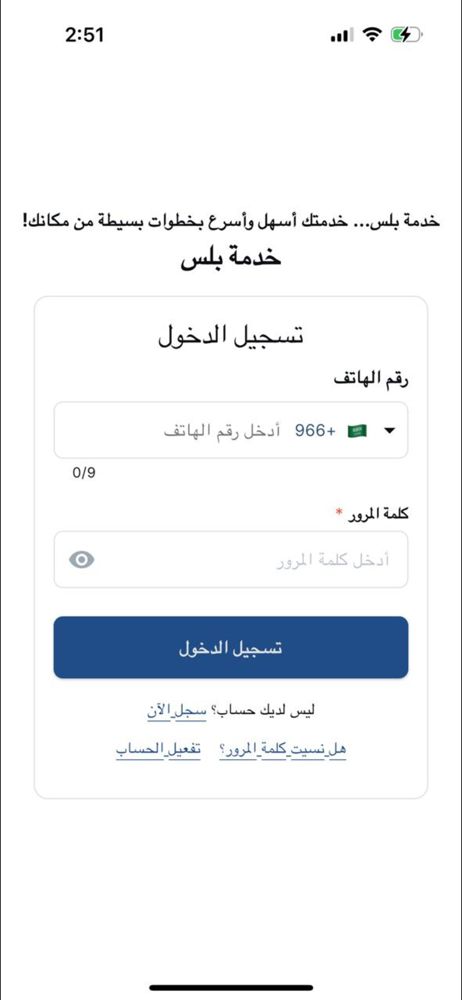

# Screenshots Gallery

This gallery provides a visual overview of the application's features and user interface.

## Authentication

### Login

### Sign Up

## Home & Services

### Home (Light Mode)

### Home (Dark Mode)

### Service Request Creation

### Force Update Dialog

## Requests

### My Requests

### My Requests (Dark Mode)

### Request Status Progression

## Chat & Communication

### Chat List

### Chat Search / Bot

### Chat (Dark Mode)

### Incoming Call (Background)

### Incoming Call (Foreground)

### Incoming Call (Termination)

## Profile & Settings

### Profile Settings

### Profile (Dark Mode)

